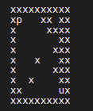
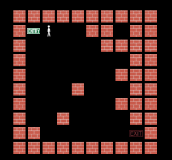
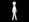
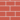

# Maze-game

## Project Description

Design and implementation of a reinforcement learning environment, for training an agent using a Q-Learning algorithm in the framework of AI-Gym.

 

### Goal

The purpose of the project is to show that the agent, through reinforcement learning, can learn to move in the labyrinth without bumping on the walls.

### Environment

A mxn grid of cells where each cells is either empty (white) or a wall (coloured), where the agent is located in a upper left position (es. cell 2,2 in figure) and the exit is lower rigth position and certain percentage of random walls cells represent the labyrinth.

### Agent

The agent available action are the four movement actions: Up, Down, Left, Right.

### State

The percept state returned from the environment is a representation of the Moore 8-neighborhood centered in agent position.

### Actions effect

Each actions has the effect of moving the corresponding position of the agent in the environment and returning the appropriate state and reward.
Moving toward a wall causes the agent bumping in the wall without changing position

### Reward

Each movement action has a reward of -1, bumping toward a wall has a reward of -5 reaching the final exit position has a reward of 10.

### Stop condition

the agent reach the exit cell or maxK actions are executed.

## Implementation

The implementation of the environment have:

- m, n dimensions of the grid.

- percentage of walls

- maxK maximum number of actions before end

 

The system have:

- Run and train the Qlearning reinforcement learning algorithm,
- Generating and trying different labirinths during training, showing the evolution of the accumulated reward
- Saving the Q(State, Action) matrix, Loading a saved Q matrix
- Executing the agent step-by-step on a given labirynth showing the reward

 

## File Description

- main.py

 

Inside the file we have emoticons for a small graphical "entry" of the project plus it contains the main function called main_menu()

 

- choices.py

 

Inside this file we have a series of selectable menus each of which will lead the user to select a different layout of the map and walls based on the difficulty chosen.

 

- game.py

 
 
Within game.py are a variety of classes that are used to "disegnate" graphically via the turtle library the user's various movements and the map Obviously here we would have a correspondence between the maze selected before and the map in graphical form. The correspondence is also present in the terminal implementation within the map_env.py file

 

- map_env.py

 

Within the map_env.py we have a representation of the map and all locations of both the agent and the environment. In this file is also transformed the selected matrix the matrix taken from the dataset (level.py) into a binary sequence and saved to the file labyrinth.

 

- level.py

 

Within the file is a dataset of maps that the user can select from the various menus.

 

- q_learning.py

 

It has the task of managing the Q matrix: saving it to appropriate file and loading it into memory, manage the training (training) and execution phase. Here resides the algorithm of QLearning proper.

 

- Images

 

The images folder contains the sprites that are used for the movement of the character in the graphics part.

 

## Project display

Two parts are visible in this project, from terminal or graphics.

### Terminal

This mode shows the matrix in the terminal. The elements that make up this type of representation are:

- **x:** indicates the wall
- **empty space:** is traversable by the agent
- **p:** indicates the agent
- **u:** indicates the exit of the maze

 

 

### Graphics

This type of implementation is shown on the screen a turtle window with inside a grid representing the maze.

 

 

It represents entry of the labyrinth.

 

It represents exit of the labyrinth.

 

It represents agent in the labyrinth.

 

It represents the wall of the labyrinth.

