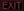

# 🧱 Maze-game

Q-learning project where an agent learns by himself to find the exit inside a maze. The project is implemented as a level-based game.

---

- [🔧 Installation](#installation)
- [📖 Project Description](#project-description)
  - [🎯 Goal](#goal)
  - [🌐 Environment](#environment)
  - [🤖 Agent](#agent)
  - [🧠 State](#state)
  - [🎁 Reward](#reward)
  - [🛑 Stop_Condition](#stop-condition)
- [⚙️ Implementation](#implementation)
- [📁 Project_Structure](#file-description)
  - [🔑 main.py](#mainpy)
  - [📋 choices.py](#choicespy)
  - [🎮 game.py](#gamepy)
  - [🗺️ map_env.py](#mapenvpy)
  - [🎲 level.py](#levelpy)
  - [🧩 q_learning.py](#qlearningpy)
  - [🖼️ Images](#images)
- [🖥️ Project_Display](#project-display)
  - [💻 Terminal](#terminal)
  - [🎨 Graphics](#graphics)
- [🏆 Conclusion](#conclusions)

---

## 🔧 Installation

Dependencies described in the `requirements.txt` file were used for the project.

It is advisable to install everything on a **virtual environment**.

After installing the dependencies you can start the project with the command:

```bash
python3 main.py
```

---

## 📖 Project Description

Design and implementation of a reinforcement learning environment, for training an agent using a Q-Learning algorithm in the framework of AI-Gym.

### 🎯 Goal

The purpose of the project is to show that the agent, through reinforcement learning, can learn to move in the labyrinth without bumping on the walls.

### 🌐 Environment

A mxn grid of cells where each cell is either empty (white) or a wall (coloured), where the agent is located in an upper left position (e.g., cell 2,2 in figure) and the exit is in the lower right position with a certain percentage of random walls cells representing the labyrinth.

### 🤖 Agent

The agent's available actions are the four movement actions: Up, Down, Left, Right.

### 🧠 State

The percept state returned from the environment is a representation of the Moore 8-neighborhood centered on the agent's position.

### 🎁 Reward

Each movement action has a reward of -1, bumping toward a wall has a reward of -5, and reaching the final exit position has a reward of 10.

### 🛑 Stop Condition

The agent reaches the exit cell or maxK actions are executed.

---

## ⚙️ Implementation

The implementation of the environment has:

- m, n dimensions of the grid.
- Percentage of walls.
- maxK maximum number of actions before the end.

The system has:

- Run and train the Qlearning reinforcement learning algorithm.
- Generating and trying different labyrinths during training, showing the evolution of the accumulated reward.
- Saving the Q(State, Action) matrix, Loading a saved Q matrix.
- Executing the agent step-by-step on a given labyrinth, showing the reward.

---

## 📁 Project_Structure

### 🔑 main.py

Contains the main function called `main_menu()`.

### 📋 choices.py

Provides a series of selectable menus that lead the user to select a different layout of the map and walls based on the chosen difficulty.

### 🎮 game.py

Contains classes that graphically "draw" the user's various movements and the map via the turtle library.

### 🗺️ map_env.py

Represents the map and all locations of both the agent and the environment. Transforms the selected matrix into a binary sequence and saves it to the file `labyrinth`.

### 🎲 level.py

A dataset of maps that the user can select from the various menus.

### 🧩 q_learning.py

Manages the Q matrix: saving it to an appropriate file and loading it into memory, managing the training and execution phase.

### 🖼️ Images

Contains the sprites used for the movement of the character in the graphics part.

---

## 🖥️ Project display

Two parts are visible in this project, from terminal or graphics.

### 💻 Terminal

This mode shows the matrix in the terminal. The elements that make up this type of representation are:

- **x:** indicates the wall
- **empty space:** is traversable by the agent
- **p:** indicates the agent
- **u:** indicates the exit of the maze

<br>

<p align="center">
  
</p>


<br>

### 🎨 Graphics

This type of implementation is shown on the screen a turtle window with inside a grid representing the maze.

<br>

<p align="center">
  
</p>

<br>

It represents entry of the labyrinth.

<p align="center">
  
</p>

<br>

It represents exit of the labyrinth.

<p align="center">
  
</p>

<br>

It represents agent in the labyrinth.

<p align="center">
  
</p>

<br>

It represents the wall of the labyrinth.

<p align="center">
  
</p>


---

## 🏆 Conclusions

As seen above, the maze is chosen from the dataset of maps made available. Thus, it was possible to both manage the size of the maps and the amount of wall inside, while still ensuring that the user could select the choice he or she felt was most appropriate. Another important advantage was that during the creation static maps there was no recourse to checking for the existence of a possible solution, because precisely the maps always provided a path leading to the exit of the maze. We can conclude as can be seen from the results that the Qlearning algorithm is able to lead the agent to the exit in the first 2 levels, while in the third level, due to of the choice of algorithm parameters that fail to make it perform on the dimensions of the matrix. By going to increase the number of epochs and steps we still go to find the solution.

<br>

---

# _Maze Game_

_Enjoy 2F_
